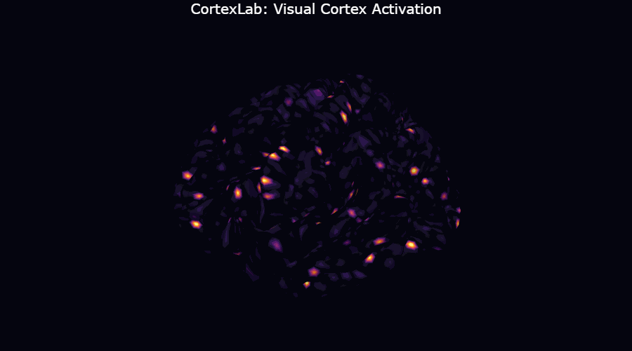

<p align="center">
  <h1 align="center">CortexLab</h1>
  <p align="center">
    <b>Enhanced multimodal fMRI brain encoding toolkit built on <a href="https://github.com/facebookresearch/tribev2">Meta's TRIBE v2</a></b>
  </p>
  <p align="center">
    <a href="https://github.com/siddhant-rajhans/cortexlab"></a>
    <a href="https://github.com/siddhant-rajhans/cortexlab/network/members"></a>
    <a href="https://github.com/siddhant-rajhans/cortexlab/blob/master/LICENSE"></a>
    <a href="https://www.python.org/downloads/"></a>
    <a href="https://huggingface.co/SID2000/cortexlab"></a>
    <a href="https://huggingface.co/spaces/SID2000/cortexlab-dashboard"></a>
  </p>
  <p align="center">
    
  </p>
</p>

CortexLab extends TRIBE v2 with streaming inference, interpretability tools, brain-alignment benchmarking with statistical testing, temporal dynamics analysis, ROI connectivity mapping, and cognitive load scoring. **76 tests**, published on HuggingFace, with an [interactive dashboard](https://github.com/siddhant-rajhans/cortexlab-dashboard).

## What Can You Do With CortexLab?

| Feature | What it does |
|---|---|
| **Brain-Alignment Benchmark** | Score any AI model (CLIP, DINOv2, V-JEPA2) on how "brain-like" its representations are, with permutation tests, bootstrap CIs, and FDR correction |
| **Cognitive Load Scorer** | Predict visual complexity, auditory demand, language processing, and executive load from brain activation patterns |
| **Temporal Dynamics** | Analyze peak response latency per brain region, lag correlations, and sustained vs transient response decomposition |
| **ROI Connectivity** | Compute functional connectivity matrices, cluster brain networks, and derive graph metrics (degree, betweenness, modularity) |
| **Streaming Inference** | Real-time sliding-window predictions from live feature streams for BCI pipelines |
| **Modality Attribution** | Per-vertex importance scores revealing which modality (text/audio/video) drives each brain region |
| **Cross-Subject Adaptation** | Adapt the model to new subjects with minimal calibration data via ridge regression |

## Quick Results

Brain alignment comparison across 4 AI models (synthetic benchmark):

```
=== Brain Alignment Comparison Results ===

  clip-vit-b32:
           rsa: +0.0407  (p=0.104, CI=[0.0109, 0.2032])
           cka: +0.8561  (p=0.174, CI=[0.9025, 0.9367])

  dinov2-vit-s:
           rsa: -0.0052  (p=0.542, CI=[-0.0421, 0.1636])
           cka: +0.8434  (p=0.403, CI=[0.8948, 0.9315])

  vjepa2-vit-g:
           rsa: +0.0121  (p=0.333, CI=[-0.0099, 0.1662])
           cka: +0.8731  (p=0.438, CI=[0.9151, 0.9442])

  llama-3.2-3b:
           rsa: -0.0075  (p=0.642, CI=[-0.0257, 0.1445])
           cka: +0.8848  (p=0.731, CI=[0.9217, 0.9493])
```

Run it yourself: `python -m experiments.brain_alignment_comparison --config experiments/config/brain_alignment_comparison.yaml`

## Prerequisites

The pretrained TRIBE v2 model uses **LLaMA 3.2-3B** as its text encoder. You must accept Meta's LLaMA license before using it:

1. Visit [llama.meta.com](https://llama.meta.com/) and accept the license
2. Request access on [HuggingFace](https://huggingface.co/meta-llama/Llama-3.2-3B)
3. Authenticate: `huggingface-cli login`

## Installation

```bash
git clone https://github.com/siddhant-rajhans/cortexlab.git
cd cortexlab
pip install -e ".[analysis]"
```

Optional extras: `[plotting]` (brain viz), `[training]` (PyTorch Lightning), `[dev]` (testing)

## Quick Start

### Inference

```python
from cortexlab.inference.predictor import TribeModel

model = TribeModel.from_pretrained("facebook/tribev2", device="auto")
events = model.get_events_dataframe(video_path="clip.mp4")
preds, segments = model.predict(events)
```

### Brain-Alignment Benchmark

```python
from cortexlab.analysis import BrainAlignmentBenchmark

bench = BrainAlignmentBenchmark(brain_predictions, roi_indices=roi_indices)
result = bench.score_model(clip_features, method="rsa")

# Statistical testing
observed, p_value = bench.permutation_test(clip_features, method="rsa", n_permutations=1000)
score, ci_lower, ci_upper = bench.bootstrap_ci(clip_features, method="rsa")
```

### Cognitive Load Scoring

```python
from cortexlab.analysis import CognitiveLoadScorer

scorer = CognitiveLoadScorer(roi_indices)
result = scorer.score_predictions(predictions)
# result.visual_complexity, result.auditory_demand, result.language_processing, result.executive_load
```

### Temporal Dynamics

```python
from cortexlab.analysis import TemporalDynamicsAnalyzer

analyzer = TemporalDynamicsAnalyzer(roi_indices, tr_seconds=1.0)
result = analyzer.analyze(predictions, model_features)
# result.peak_latencies, result.temporal_correlations, result.sustained_components
```

### ROI Connectivity

```python
from cortexlab.analysis import ROIConnectivityAnalyzer

conn = ROIConnectivityAnalyzer(roi_indices)
result = conn.analyze(predictions, n_clusters=4, threshold=0.3)
# result.correlation_matrix, result.clusters, result.graph_metrics
```

### Streaming Inference

```python
from cortexlab.inference import StreamingPredictor

sp = StreamingPredictor(model._model, window_trs=40, step_trs=1, device="cuda")
for features in live_feature_stream():
    pred = sp.push_frame(features)
    if pred is not None:
        visualize(pred)  # (n_vertices,)
```

## Architecture

```
src/cortexlab/
  core/          Model (return_attn, gradient checkpointing, fp16, ONNX export)
  data/          Dataset loading, HCP ROI utilities, 4 fMRI studies
  training/      PyTorch Lightning pipeline (FSDP, W&B)
  inference/     Predictor, streaming, modality attribution
  analysis/      Brain alignment (RSA/CKA/Procrustes + stats), cognitive load,
                 temporal dynamics, ROI connectivity
  viz/           Brain surface visualization (nilearn, pyvista)
```

## Interactive Dashboard

A futuristic Streamlit dashboard with glassmorphism UI, 3D brain visualization, and live inference:

- **3D Brain Viewer**: rotatable fsaverage brain with activation overlays, publication-quality 4-panel views
- **Brain Alignment**: scores with error bars, null distributions, RDM visualization, FDR correction
- **Cognitive Load**: timeline with confidence bands, dimension correlation, comparison mode
- **Temporal Dynamics**: raw timecourses, processing hierarchy, cross-ROI lag matrix
- **Connectivity**: partial correlation, dendrogram, modularity, network graph
- **Live Inference**: real-time brain prediction from webcam, screen capture, or video file

[Try the Live Demo](https://huggingface.co/spaces/SID2000/cortexlab-dashboard) | [Dashboard Repository](https://github.com/siddhant-rajhans/cortexlab-dashboard)

## Development

```bash
pip install -e ".[dev,analysis]"
pytest tests/ -v          # 76 tests
ruff check src/ tests/    # lint
```

## Contributing

See [CONTRIBUTING.md](CONTRIBUTING.md). Check [issues labeled "good first issue"](https://github.com/siddhant-rajhans/cortexlab/issues?q=is%3Aissue+is%3Aopen+label%3A%22good+first+issue%22) to get started.

## License

CC BY-NC 4.0 (inherited from TRIBE v2). See [LICENSE](LICENSE) and [NOTICE](NOTICE).

This project is for **non-commercial use only**. The pretrained weights are hosted by Meta at [facebook/tribev2](https://huggingface.co/facebook/tribev2) and are not redistributed by this project.

## Acknowledgements

Built on [TRIBE v2](https://github.com/facebookresearch/tribev2) by Meta FAIR.

> d'Ascoli et al., "A foundation model of vision, audition, and language for in-silico neuroscience", 2026.

See [NOTICE](NOTICE) for full attribution and third-party licenses.
